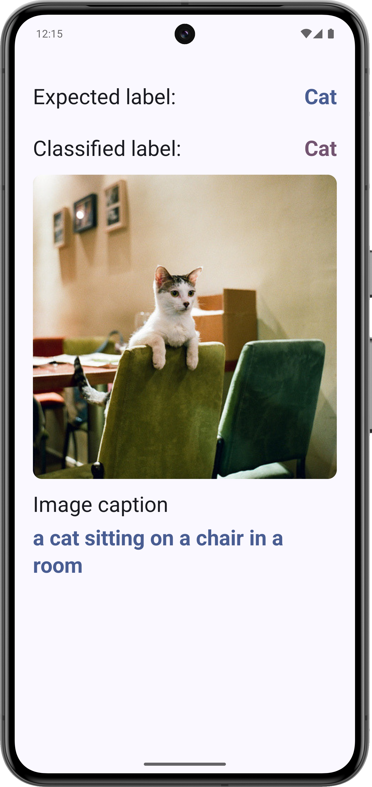
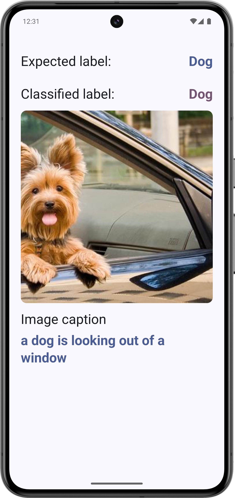
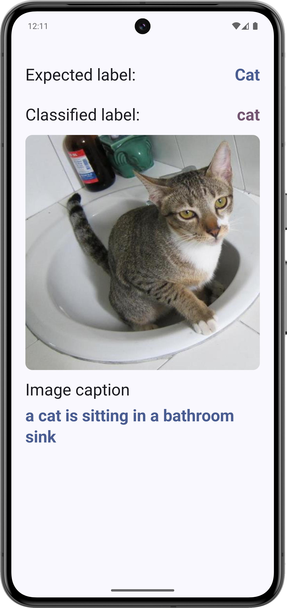
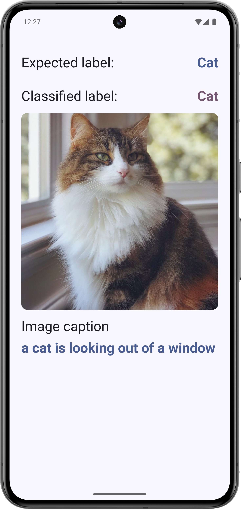

# Image Classification & Image Captioning with LiteRT

This is a fully functional Android application built with Kotlin and Jetpack Compose, demonstrating how to use a LiteRT models for on-device image classification and image captioning. The project follows modern Android development and design best practices, and serves as a practical reference for developers looking to integrate LiteRT into their own apps.

    
    
    

    
    
    

    

## Features
* Image Classification
* Image Captioning

### Libraries

* [LiteRT][litert]
* [Jetpack Core][core]
* [MVVM architectural pattern][mvvm]
* [Dependency injection with Hilt][hilt]
* [Jetpack Compose UI][compose]
* [Retrofit][retrofit] for REST API communication
* [Moshi][moshi] for parsing JSON into Kotlin classes
* [Coil][coil] for image loading

[litert]: https://github.com/google-ai-edge/LiteRT

[core]: https://developer.android.com/jetpack/androidx/releases/core

[mvvm]: https://developer.android.com/topic/libraries/architecture/viewmodel

[hilt]: https://developer.android.com/training/dependency-injection/hilt-android

[compose]: https://developer.android.com/jetpack/compose

[retrofit]: http://square.github.io/retrofit

[moshi]: https://github.com/square/moshi

[coil]: https://coil-kt.github.io/coil/compose
