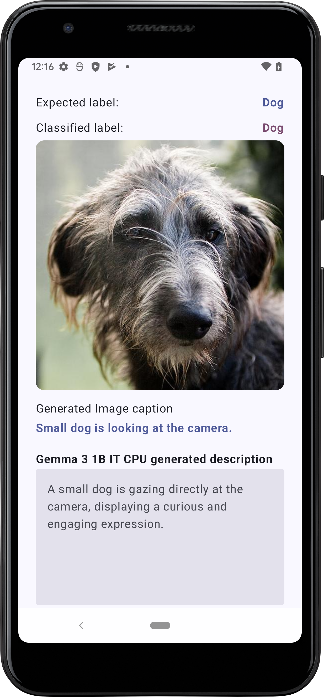
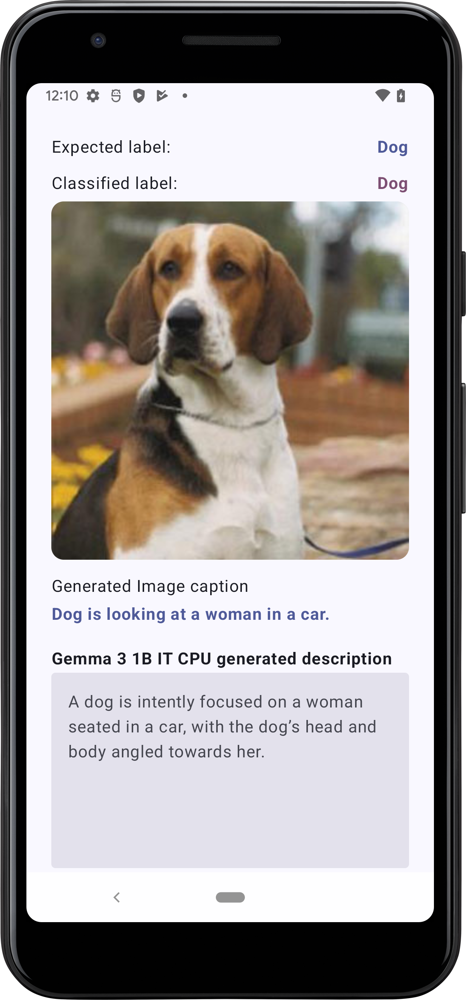
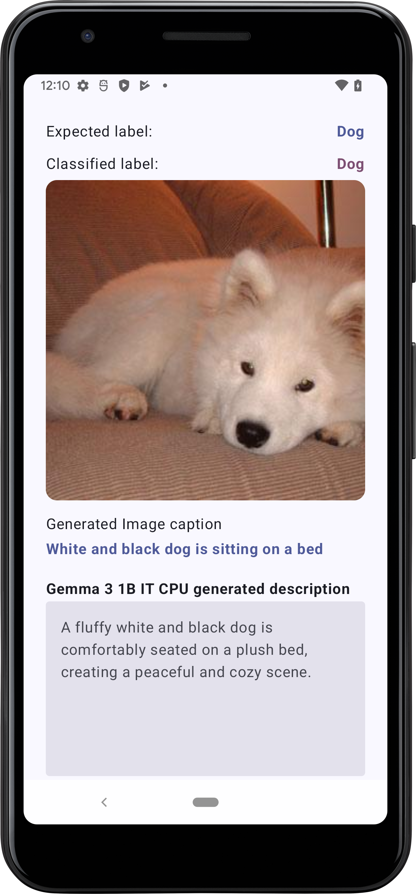
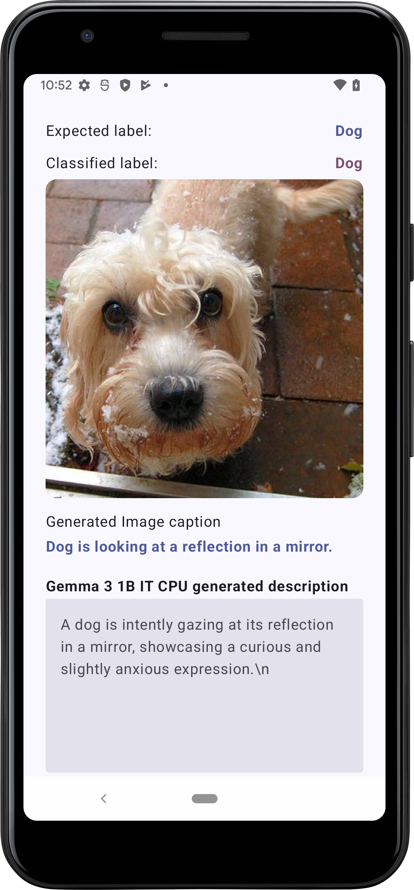
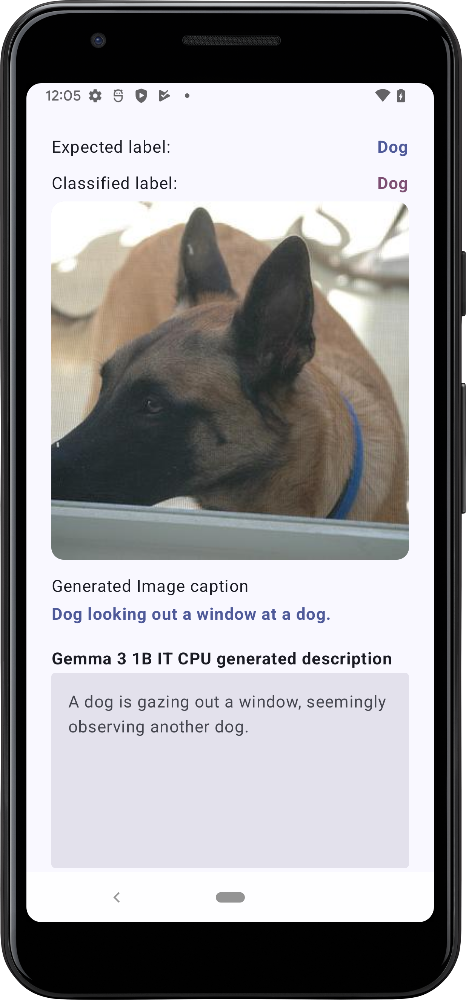

# Image Classification & Image Captioning with LiteRT

This is a fully functional Android application built with Kotlin and Jetpack Compose that showcases how to integrate LiteRT for on-device image classification and image captioning. It also demonstrates how to use MediaPipe for on-device large language model (LLM) integration, enabling natural language processing directly on the device.

The project follows modern Android development best practices and serves as a practical reference for developers interested in integrating LiteRT and MediaPipe into their own apps.

    
    
    

    
    
    

    

## Features
* Image Classification
* Image Captioning
* LLM Inference

### Libraries

* [LiteRT][litert]
* [LLM Inference][genai]
* [Jetpack Core][core]
* [MVVM architectural pattern][mvvm]
* [Dependency injection with Hilt][hilt]
* [Jetpack Compose UI][compose]
* [Retrofit][retrofit] for REST API communication
* [Moshi][moshi] for parsing JSON into Kotlin classes
* [Coil][coil] for image loading

[litert]: https://github.com/google-ai-edge/LiteRT

[genai]: https://ai.google.dev/edge/mediapipe/solutions/genai/llm_inference/android

[core]: https://developer.android.com/jetpack/androidx/releases/core

[mvvm]: https://developer.android.com/topic/libraries/architecture/viewmodel

[hilt]: https://developer.android.com/training/dependency-injection/hilt-android

[compose]: https://developer.android.com/jetpack/compose

[retrofit]: http://square.github.io/retrofit

[moshi]: https://github.com/square/moshi

[coil]: https://coil-kt.github.io/coil/compose
